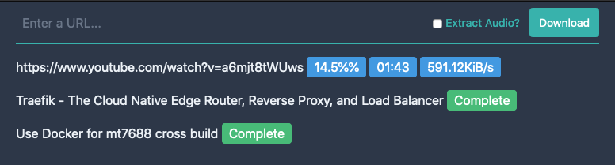

# YTDLWeb

[WIP] Simple web front-end to download files using [youtube-dl](http://ytdl-org.github.io/youtube-dl/).



## Using

Docs to be done...

## Demo with docker

You should be able to run :
```bash
docker-compose up --build
```
And then after a little time when everything is running point your browser at http://localhost:3000 .

