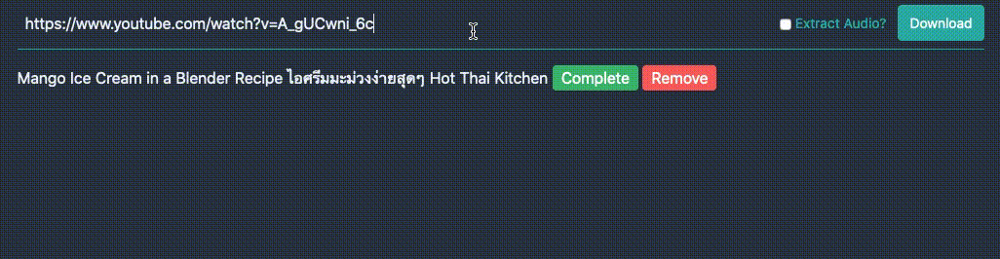

# YTDLWeb

[WIP] Simple web front-end to download files using [youtube-dl](http://ytdl-org.github.io/youtube-dl/).



## Using

Enter a URL to a video stream that's [supported by youtube-dl](http://ytdl-org.github.io/youtube-dl/supportedsites.html) and click the 'Download' button.  Your video should start downloading after five seconds or so.  It will show the progress as it downloads and then change the name
to the actual video title once it's done.

You can optionally tick the 'Extract audio' checkbox - that will download the video and then extract the audio to an mp3 file.  This can be handy when trying to grab a music track or conference talk for instance.

## Quick demo with docker

You should be able to run :
```bash
docker-compose up --build
```
And then after a little time when everything is running point your browser at http://localhost:3000 .

## Deploying to Docker Swarm

If you have a swarm set up you should be able to look at the `build-image.sh` script and get it to build & push an image.  Then you can edit the `stack.yml` file to suit your paths (especially the volume that maps to `/var/www/html/storage/app/downloads`) and run something like this to deploy it :

```
export IMAGE_NAME=you/your-image:tag
docker stack deploy -c stack.yml ytdlweb
```

__Note:__ The code will attempt to change the user permissions on the directory mounted at `/var/www/html/storage/app/downloads` so you should make sure this directory is only for use by this app.  Eg, if you have a general 'downloads' folder, make a sub-directory like 'youtube' and mount that as the volume.

## Deploying manually

You'll need PHP v7.3+ and a webserver.  You also need something which will run the queue process in the background for you like systemd or supervisor.

... More to come

## Thanks

Thanks to some other open source projects that have made writing this a breeze.  [Laravel](https://laravel.com/), [LiveWire](https://laravel-livewire.com/), [Tailwind](https://laravel-livewire.com/).  Also the really nice youtube-dl library [norkunas/youtube-dl-php](https://github.com/norkunas/youtube-dl-php) and of course the good people at [youtube-dl](http://ytdl-org.github.io/youtube-dl/) itself.

